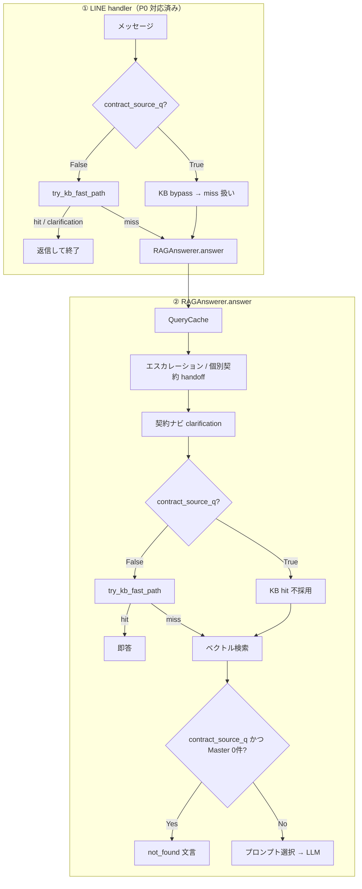

# Master 文書ルーティング — 現状と設計提案

| 項目 | 内容 |
|------|------|
| **対象読者** | 実装者（一次）、新規メンバー（オンボーディング）、意思決定者（§6・§7 のみで可） |
| **ステータス** | **Reviewed** — 2026-05-24 should_search_master() 導入・v0.8 更新 |
| **バージョン** | **v0.8** |
| **作成日** | 2026-05-16 |
| **最終更新** | 2026-05-24 (v0.8) |
| **レビュー** | ドキュメント所感 OK（残ギャップは §8.2 のアクションで追跡） |
| **コード正本** | `src/contract_query_router.py`, `src/rag_answerer.py`, `src/interfaces/line/handler.py`, `src/kb_fast_path.py` |
| **関連 ADR** | `CONTEXT.md` §6 ADR-001（Master TXT 正、KB は要約＋ルーティング） |
| **次回レビュー** | ルーティング改修 PR マージ時、または四半期ごと |

**構成:** §1–5＝**現状記述**（ドキュメント1）／ §6–8＝**設計提案**（ドキュメント2）

**レビュー指摘 → 対応節**

| 指摘 | 節 |
|------|-----|
| 読者定義・ステータス | 本表・読み方 |
| KB fast path hit 条件 | §5 |
| 両フラグ同時 True | §4 |
| 判定早見表（「語次第」排除） | §3 |
| Mermaid not_found の接続 | §2（A9→A10） |
| 定量データ | §6 |
| multi ルーター FP/FN・未配線 | §7.2 → **§8.2 AIT-RTE-*** |
| eval・CLI と master_top_k=0 の整理 | §7.3 |
| 今すぐ／中長期の境界 | §8.1 |
| 担当・期限・完了基準 | §8.2 |

**読み方**

- **実装者:** §2（フロー）→ §3（判定早見表）→ §4（両フラグ同時 True）→ §8（改修ロードマップ）
- **新規メンバー:** §1（3 経路）→ §3 → `CONTEXT.md` の KB fast path 節
- **意思決者:** §1・§6（定量）・§7（一般 RAG 要否）・§8

> 本書のフロー・閾値は上記ファイルと突合すること。乖離を見つけたら **コードを正**とし、本書を更新する。

---

## 1. 回答経路の全体像（3 段ゲート）

| ゲート | 関数 | 経路 | 典型レイテンシ | ベクトル検索 | 権威（ADR-001） |
|--------|------|------|----------------|--------------|-----------------|
| **① KB fast path** | `try_kb_fast_path()` | FAQ 即答 | 低（LLM なし） | 使わない | KB は要約 |
| **② Master RAG** | `should_search_master()=True` | B. 契約ソース RAG | 高 | 使う（`force_master`） | **Master が正** |
| **③ それ以外** | 上記いずれも False | C. 一般 RAG / clarification | 高 | 使う | KB + Master 混在 |

`should_search_master()` は `is_contract_source_question()` の上位関数（v0.8〜）。  
4 レイヤ OR 構造: **A.** 既存 csq 判定 → **B.** topic keyword（XD-03/MH-05/MH-06 含む）→ **D.** explicit doc trigger / strong meta + domain。

**LINE と `RAGAnswerer.answer()` の差分（必読）**

| 段階 | KB fast path | `should_search_master` の扱い |
|------|--------------|-------------------------------|
| **LINE `handler.py`** | **`should_search_master=False` のみ実行**（v0.8〜）| `True` なら `KBFastPathResult(kind="miss")` で即 bypass → `RAGAnswerer.answer()` へ |
| **`answer()` 内** | miss 後のみ | **`contract_source_q=True`（= `is_contract_source_question`）なら KB hit 不採用** |

> **P0 変更点（2026-05-18 `rental_rag_poc-7xd`）**: 旧来は LINE handler で全クエリが `try_kb_fast_path` を通過し、重説質問でも KB hit で終了しうる不具合があった。P0 で `handler.py` に `is_contract_source_question()=True` → bypass を追加（v0.8 で `should_search_master()` に昇格）。

---

## 2. 処理フロー（LINE → answer）

**not_found の位置:** `contract_source_q=True` かつ検索後も **Master チャンクが 0 件**のときのみ。FAQ にはフォールバックしない（`rag_answerer.py` 1791 行付近）。

---

## 3. 判定早見表（一か所に集約）

### 3.1 `should_search_master()`（`is_contract_source_question` はラッパー）

**4 レイヤ OR 構造（いずれかで True）:**

| レイヤ | 条件 | True 例 | False 例 |
|--------|------|---------|---------|
| **A. 既存 csq 判定** | 第◯条・特約・頭書・別表・本文・重説明示・違約金額 等 | 本文第4条の賃料は… / 重説の3番では… | 契約更新したい |
| **B. topic keyword** | 解約+通知 / 解約予告 → 第14条 | 解約の通知は何日前？ | 解約したいです |
| ↑ B 続き | クロス+費用/負担 → 別表（MH-05） | クロスの費用負担はどう決まる？ | 水漏れしています |
| ↑ B 続き | 清掃費 / 清掃+退去 → 特約⑥（MH-06） | 退去時の清掃費はいくら？ | 修繕をお願いしたい |
| **D. doc trigger / meta** | 重要事項説明書・重説（単独 OK）/ 強 meta※ + 賃貸 domain | 原状回復はどう規定されてますか | コンビニを調べて |

※ 強 meta（_STRONG_DOC_META）: `記載` / `書いて` / `書かれ` / `どう書` / `定め` / `規定`  
弱 meta（`教えて` 等）単体では Layer D は発火しない（ノイズ防止）。

### 3.2 `is_important_matters_question`（検索後 boost のみ）

| 含まれる語 | 例 |
|------------|-----|
| 重要事項 / 重要事項説明書 / 重説 / ハザード / 洪水 / 高潮 / 浸水 / 水防法 / 土砂災害 / 津波 | 津波災害警戒区域ですか / ハザードマップで注意点は？ |

**単独ではルートは変えない。** `contract_source_q` と組み合わせて §4 を読む。

### 3.3 フラグ組み合わせ → 経路

`should_search_master` は `is_contract_source_question` のスーパーセット（v0.8〜）。  
KB bypass と `answer()` 内は `should_search_master` / `contract_source_q` を共有する。

| should_search_master (= contract_source_q) | is_important_matters | 経路 | プロンプト（Master あり時） |
|--------------------------------------------|----------------------|------|------------------------------|
| False | False | **C. 一般 RAG** | `answer_prompt` |
| False | True | **C. 一般 RAG**（**boost 発火**：section_id/rest-sort のみ） | 同上 |
| True | False | **B. 契約ソース RAG** | `contract_source_qa_prompt` |
| True | True | **B + 重説 boost** | `contract_source_qa_prompt` |

---

## 4. 両フラグ同時 True のとき（具体手順）

**例:** 「重要事項説明書の3番では家賃や共益費はいくらと記載されていますか」

| 順 | 処理 | 結果 |
|----|------|------|
| 1 | LINE: `try_kb_fast_path` | 多くは **miss**（該当 intent が無い／スコア不足） |
| 2 | `contract_source_q=True` | `answer()` 内 KB **hit 不採用** |
| 3 | `_hierarchical_search(force_master=True)` | 契約書 + **重要事項説明書.txt** を検索 |
| 4 | `extract_important_matters_section_id` → `"3"` | `section_exact:3` で §3 チャンクを先頭へ |
| 5 | `apply_master_document_boost` | 残りは `doc_kind=important_matters` を契約より前へ |
| 6 | リランク | `other_docs（Master）` を **kb_faq より前** |
| 7 | `_select_docs_for_contract_source` | Master ありなら **kb_faq を証拠から除外** |
| 8 | プロンプト | `contract_source_qa_prompt`（§3 金額は根拠どおり述べる例外あり） |
| 9 | Master 0 件 | 「契約書・重要事項説明書（根拠情報）内では確認できません。」 |

---

## 5. KB fast path の hit 条件（フロー最初の分岐）

**対象行:** `faq_kb.csv` の **`fast_path_enabled=true`** のみ。

**スコア（`src/kb_fast_path.py`）**

| 要素 | 重み |
|------|------|
| primary 一致 | +3 / 語 |
| secondary / synonym | +1 |
| exclude 一致 | −5 |
| primary 完全一致ボーナス | +3（別ロジック） |

**閾値（既定 `Config`）**

| 設定 | 既定値 | 意味 |
|------|--------|------|
| `kb_fast_path_score_threshold` | **4** | これ未満は原則 miss |
| `kb_fast_path_ambiguity_delta` | 2 | 上位2意図の差がこれ以下 → clarification |
| `kb_fast_path_short_max_len` | 10 | 短文＋ `needs_clarification_when_short` → clarification |

**結果 `kind`**

| kind | 条件 |
|------|------|
| **hit** | 最高スコア ≥ 閾値、曖昧さ解消、`_legal_skip` 外 |
| **clarification** | 閾値未満だが曖昧トピック / 2 候補拮抗 / 短文ルール |
| **miss** | 上記以外 → RAG へ |

**計測（`docs/eval_log.md` Sprint 2、62 代表クエリ・シミュレーション）**

| 指標 | 値 | 備考 |
|------|-----|------|
| Hit + clarification 率 | **74%** (46/62) | 目標 >60% ✅ |
| Fallback（miss）率 | **26%** (16/62) | 目標 <20% ⚠️ |
| 活用形修正後（推定） | **~14.5%** (9/62) | 本番 eval で確定予定 |
| 誤ヒット | **0%** | 62 件シミュレーション |

---

## 6. 定量データ（改修判断用）

| 指標 | 計測値 | 出典 | 備考 |
|------|--------|------|------|
| KB fast path miss 率（代表62） | 26% → 推定 14.5% | `eval_log.md` | シミュレーション |
| Metrics v2 Recall@5（17問 eval） | **0.941** | `eval_log.md` 2026-05-02 | 契約ソース系含む |
| ハルシネーション fact_error | **0.0** | 同上 | |
| 本番 eval Recall@5（run 20bd15ef） | **1.0** | `eval_log.md` | サブセット；重説専用ではない |
| LINE p95 レイテンシ | **未計測** | — | **§8.2 AIT-MET-01** |
| 契約ソース RAG トークン/問 | **未計測** | — | **§8.2 AIT-MET-01** |
| `_route_query` LLM ルーター精度 | **未配線** | `grep`: 定義のみ、**`answer()` から未呼び出し** | **§8.2 AIT-RTE-01〜03**（把握済み＋追跡中） |

> 「遅い・トークン多い」は **定性**（Master 検索 + LLM 生成）。未計測は **§8.2** のアクションで埋める（「把握のみ」で終わらせない）。

---

## 7. 一般 RAG（C）— 要るか

### 7.1 結論

| 問い | 答え |
|------|------|
| **RAG という段は要るか** | **要る**（fast path miss・表現ゆれ・eval） |
| **KB + Master の常時混在は要るか** | **全面は不要**。`deal_only` / `master_only` / 明示 `multi` に分割推奨 |

### 7.2 multi ルーターについて（提案の前提）

**記録の位置づけ（2026-05-17 更新）:** AIT-RTE-01 の決定により、以下のギャップは **解消済み**。

- ~~`RAGAnswerer._route_query()` は LLM で deal_only / master_only / multi を返す設計だが、`answer()` からは呼ばれていない。~~ → **AIT-RTE-01 決定: 削除済み**（`src/rag_answerer.py` から除去）。AIT-RTE-02/03 は N/A クローズ。
- 実際の `source_type` は **検索結果の有無**で決まる（`csv_docs` と `pdf_docs` の両方があると `multi`）。この挙動は継続。
- 非契約ソース（`contract_source_q=False`）かつ RAG 経路（`decided_kb_path=False`）での `master_top_k` 未指定は **AIT-TIER-01 で解消済み**（`master_top_k=0` を明示）。

#### AIT-RTE-01 決定記録（2026-05-17）

**決定: `_route_query()` を削除する。**

`_route_query()` は初期実装から `answer()` に配線されたことがなく、現状デッドコードである。削除を選択する理由は三点。第一に、バイナリの振り分け（契約ソース問い合わせか否か）は `is_contract_source_question()` が決定論的・ゼロ LLM コストで提供しており、同等の機能が既存ルーターで充足される。第二に、採用した場合クエリごとに余分な LLM 呼び出し（+200〜800 ms）が加わるが、精度検証（FP/FN）が未実施のため改善効果は不明であり、Routing-First 設計の「最小レイテンシ優先」に逆行する。第三に、ルータープロンプトが FAQ 項目（ゴミ出し・トラブル等）を "deal_only" に分類する設計になっており、これらは Fast Path で処理すべきクエリと混同されていて、配線前にプロンプトの全面再設計が必要になる。却下案: **採用**（精度未検証かつレイテンシ増）、**ルールベース置換**（`is_contract_source_question()` で既にカバー済みのため重複）。AIT-RTE-02・AIT-RTE-03 は本決定により **N/A**（クローズ対象）。

### 7.3 eval・CLI への影響

| 利用経路 | 依存 | `master_top_k=0` 化の影響 |
|----------|------|-------------------------|
| `run_simple_eval.py` | 一般 RAG / 契約ソース混在 | **deal_only 想定問では Recall 定義の見直しが必要** |
| `rental_qa_chat.py` | 同上 | 同上 |
| LINE 本番 | handler KB 先行 + answer | **即時変更は非推奨**（別テスト必須） |

**自己矛盾の解消:** 「eval は一般 RAG 経路に依存する」＝ **経路そのものは必要**。「今すぐ master_top_k=0」は **中長期**（eval セットと閾値を揃えてから）。§8 参照。

---

## 8. 改修ロードマップ（工数・リスク・依存）

### 8.1 施策一覧（優先のみ）

| 優先 | 施策 | 区分 | 工数感 | リスク | 依存 | アクション ID |
|------|------|------|--------|--------|------|----------------|
| ~~P0~~ | ~~LINE: `contract_source_q` を KB **より前**に評価~~ | ~~今すぐ~~ | 小 | 中 | — | **✅ 完了** `rental_rag_poc-7xd`（2026-05-18） |
| ~~P0~~ | ~~重説修正の **reindex + Cloud Run 再デプロイ**~~ | ~~今すぐ~~ | 小 | 低 | — | **✅ 完了** `rental_rag_poc-d28`（rev `line-webhook-20260518-2151`） |
| ~~P1~~ | ~~`eval_log` にルーティング Tier 別メトリクス追加~~ | ~~今すぐ~~ | 小 | 低 | — | **✅ 完了** AIT-MET-02（2026-05-17） |
| ~~P1~~ | ~~レイテンシ・トークン **1 回計測**~~ | ~~今すぐ~~ | 中 | 低 | — | **✅ 完了** AIT-MET-01（2026-05-17） |
| ~~P2~~ | ~~`is_important_matters` 時も boost 適用~~ | ~~中長期~~ | 中 | 中 | — | **✅ 完了** 1-D（2026-05-22）。`master_top_k=0` 時は pool 空のため影響範囲は pool あり経路に限定 |
| ~~P2~~ | ~~`deal_only` で `master_top_k=0` デフォルト~~ | ~~中長期~~ | 中 | 高 | — | **✅ 完了** AIT-TIER-01（2026-05-17） |
| ~~P3~~ | ~~`_route_query` 方針決定~~ | ~~中長期~~ | 小 | 低 | — | **✅ 完了** AIT-RTE-01: 削除（2026-05-17） |
| ~~P3~~ | ~~`_route_query` 配線（採用時）~~ | ~~中長期~~ | 大 | 高 | — | **N/A** AIT-RTE-01 削除のためクローズ |
| ~~P3~~ | ~~multi ルーター FP/FN 評価~~ | ~~中長期~~ | 中 | 高 | — | **N/A** AIT-RTE-01 削除のためクローズ |
| P3 | プロンプトを重説用 / 契約書用に分割 | **中長期** | 大 | 中 | ADR-001 合意 | （ADR 後） |

**境界の軸**

- **今すぐ:** 本番不具合、LINE ルート不整合、**§6 の未計測（AIT-MET-01）**。
- **中長期:** eval・本番挙動・**ルーター配線（AIT-RTE-*）** に波及するもの。

### 8.2 アクションアイテム（担当・期限・完了基準）

> **担当者:** 未記名の項目は **Beads / GitHub Issue にチケット化した時点で担当を1名固定**する。本表の ID をタイトルに含める（例: `[AIT-RTE-01] _route_query 方針`）。

| ID | BD | 内容（§7.2 紐づけ） | 担当 | 期限（目安） | 完了基準 |
|----|-----|---------------------|------|--------------|----------|
| **AIT-MET-01** | `rental_rag_poc-6m7` | LINE p95 レイテンシ + 契約ソース RAG の **入力トークン/問** を各 **10 問** サンプル計測 | **未アサイン** | **2026-05-31** | `docs/eval_log.md` に表追記（p95 ms、平均/ p95 トークン）。計測手順（スクリプト or Cloud Run ログクエリ）を 1 行記載 |
| **AIT-MET-02** | `rental_rag_poc-krz` | 経路別（KB hit / 契約ソース / 一般 RAG）の件数・割合を eval に記録 | **未アサイン** | **2026-05-31** | 次回 `run_simple_eval.py` 実行時に `decision_path` 集計を `eval_log.md` に貼付 |
| ~~**AIT-RTE-01**~~ | `rental_rag_poc-69f` | `_route_query` を **採用 / 削除 / ルールベース置換** のいずれかを決定 | skoyama | ~~2026-06-15~~ | **✅ 完了（2026-05-17）: 削除。§7.2 AIT-RTE-01 決定記録参照** |
| ~~**AIT-RTE-02**~~ | `rental_rag_poc-0gh` | AIT-RTE-01 で「採用」なら `answer()` に配線 | — | — | **N/A — AIT-RTE-01 が「削除」のためクローズ** |
| ~~**AIT-RTE-03**~~ | `rental_rag_poc-mrf` | multi ルーターの **FP/FN**（ラベル付きセット） | — | — | **N/A — AIT-RTE-01 が「削除」のためクローズ** |
| **AIT-TIER-01** | `rental_rag_poc-ir7` | `deal_only` 時 `master_top_k=0` | **未アサイン** | **AIT-MET-01/02 完了後** | Metrics v2 17 問 + 代表62 で回帰なし。`master_top_k=0` がデフォルト or 設定化 |

**§7.2 との対応:** 「未配線・FP/FN 未実施」＝ **AIT-RTE-01〜03 の未完了**。レビュー時は上表の **期限・完了基準** で進捗を確認する（把握済みで止めない）。

---

## 9. 正本・関連ドキュメント

| ファイル | 用途 |
|----------|------|
| `src/contract_query_router.py` | `contract_source_q` / `is_important_matters` / `section_id` |
| `src/kb_fast_path.py` | fast path スコア・clarification |
| `src/rag_answerer.py` | answer フロー・検索・プロンプト |
| `src/interfaces/line/handler.py` | LINE 先行 KB |
| `docs/eval_log.md` | 定量（KB 62 件、Metrics v2 17 問） |
| `CONTEXT.md` | ADR-001、用語定義 |
| `docs/testing/CLAUDE_CODE_JUYO_RAG_IMPLEMENTATION_PROMPT.md` | 重説不具合の調査プロンプト |
| `docs/testing/CLAUDE_CODE_MASTER_ROUTING_IMPLEMENTATION_PROMPT.md` | `should_search_master()` 導入・段階的移行（Claude Code 向け） |
| `docs/testing/CLAUDE_CODE_GRAPHRAG_PHASE02_CLOSEOUT_PROMPT.md` | Phase 0–2 確定（23問 eval → 2コミット → uye.1 クローズ） |

---

*変更履歴:*
- *v0.1 (2026-05-16): 初版・レビュー指摘一括反映*
- *v0.2 (2026-05-16): Reviewed 昇格・§8.2 アクショ�� ID（AIT-*）・§7.2 を追跡アイテムに紐づけ*
- *v0.3 (2026-05-16): §8.2 に Beads チケット ID（BD 列）を追加*
- *v0.4 (2026-05-17): AIT-RTE-01 決定記録追加（§7.2）— `_route_query` 削除・AIT-RTE-02/03 N/A クローズ*
- *v0.5 (2026-05-19): §8.1 施策一覧を完了状態��更新（P0/P1/P2/P3 完了分を ✅ に���— rev `line-webhook-20260518-2151` 本番反映済み*
- *v0.6 (2026-05-22): §3.3 テーブル更新（1-D: `is_important_matters=True` でも boost 発火）・§8.1 P2 完了マーク*
- *v0.7 (2026-05-22): §1 LINE 表・§2 Mermaid を P0 bypass（`contract_source_q=True` → KB fast path skip）に更新（1-F 残り）*
- *v0.8 (2026-05-24): §1 3 段ゲート表・§3.1 4 レイヤ早見表・§3.3 フラグ表 を `should_search_master()` 基準に刷新。XD-03（解約通知）・MH-05（クロス費用）・MH-06（清掃費）routing 追加。`handler.py` Phase 1 反映。`tests/test_master_routing.py` 追加（36 ケース）。*
