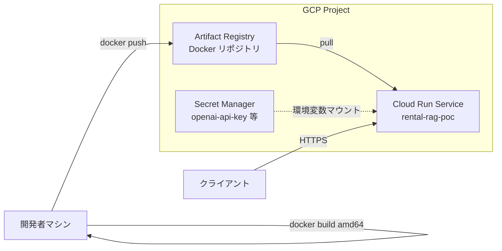

# GCP デプロイ計画と現状課題（外部 AI 解析用）

**目的**: Google Cloud（Artifact Registry / Secret Manager / Cloud Run）へのデプロイ方針を一文書にまとめ、**現在直面している問題**を事実ベースで要約する。Gemini 等の Google 系 AI によるレビュー・診断の入力として使う。

**詳細手順**: コマンドレベルは [STEP2_GCP_DEPLOY.md](STEP2_GCP_DEPLOY.md) を正とする。本書は**計画・状態・課題**に限定する。

---

## 1. システム概要（デプロイ対象）

| 項目 | 内容 |
|------|------|
| アプリ | FastAPI（LINE Webhook + ヘルスチェック + 任意で RAG デバッグ） |
| コンテナエントリ | `src.api.main:app`（Uvicorn、`PORT` で listen、`0.0.0.0`） |
| 主な HTTP パス | `GET /health`（生存）、`GET /ready`（RAG 依存の準備状況）、`POST /webhook`（LINE）、`POST /debug/rag`（開発用・フラグで無効化） |
| データ同梱 | イメージ内 `data/vector_store`、`data/faq_kb.csv` 等（Step 1 方針） |

---

## 2. アーキテクチャ（最小構成）



- **Artifact Registry**: コンテナイメージの保管・バージョン管理。
- **Secret Manager**: API キー等（Cloud Run の `--set-secrets` で環境変数に注入。**平文を `--set-env-vars` に書かない**）。
- **Cloud Run**: マネージド実行。`PORT` はランタイム注入。課金アカウント必須。

---

## 3. デプロイ計画（フェーズ）

### Phase 0: 前提

- プロジェクトに**課金**が有効。
- API 有効化: `run.googleapis.com`, `artifactregistry.googleapis.com`, `secretmanager.googleapis.com`（手順は STEP2 Part 1）。

### Phase 1: レジストリ

- リージョン（例: `asia-northeast1`）に **Artifact Registry** の Docker リポジトリを 1 つ作成。
- **Cloud Run と同一リージョン**に揃える。

### Phase 2: イメージのビルドとプッシュ

- **作業ディレクトリ**: リポジトリの **`rental_rag_poc`** ディレクトリ（親フォルダにいる場合は `cd` で移動。**すでに `rental_rag_poc` にいる状態で `cd rental_rag_poc` すると失敗する**）。
- **プラットフォーム**: Cloud Run は **`linux/amd64`**。Apple Silicon では `docker build --platform linux/amd64` を必須とする。
- `gcloud auth configure-docker ${REGION}-docker.pkg.dev`
- `docker build` → `docker tag` → `docker push`（イメージ URL 形式は STEP2「推奨変数」参照）。
- タグ例: `initial` または `YYYYMMDD-説明` で追跡可能にする。

### Phase 3: シークレット

- Secret Manager に `openai-api-key`（またはプロジェクトで採用した名前）を登録。
- 空で `create` しない。**ローカルで `OPENAI_API_KEY` を設定したうえで** `versions add` する運用を推奨。

### Phase 4: Cloud Run デプロイ

- `gcloud run deploy` でイメージ・リージョン・認証方針（初回は `--allow-unauthenticated` 可）、環境変数、シークレットマッピングを指定。
- 実行サービスアカウントに **Secret Accessor** が必要（失敗時は STEP2「Secret 参照の権限エラー時」）。

### Phase 5: 疎通確認

1. `GET /health` → **200** を最優先で確認。
2. `GET /ready` → 200 または 503（理由は JSON / ログで確認）。
3. RAG を直接試す場合は **`ENABLE_DEBUG_RAG_ENDPOINT=true`** を付与した revision のみ `POST /debug/rag` を利用（本番では無効推奨）。

### Phase 6（本番寄り・PoC 後に必ず検討）

- `RAG_SKIP_STARTUP_CHECKS=false` で厳格起動。
- **`--allow-unauthenticated` の見直し**（IAM で Invoke 権限を限定。LINE からの到達要件と両立させる）。
- **メモリ・CPU・リクエスト `--timeout`・最小インスタンス**の見直し（`/ready` や初回 RAG のレイテンシとトレードオフ）。
- **監視の HTTP チェック**を設定する場合は **`/health`** を指定し、**`/ready` をプローブに使わない**（§5.1）。
- CI/CD、ログ・アラート（別ドキュメント想定）。

---

## 4. 固定値・識別子（このプロジェクト例）

以下は**例**であり、実際の値は `gcloud run services describe` とコンソールで確認すること。

| 名前 | 例 |
|------|-----|
| `PROJECT_ID` | `reliable-bruin-191204` |
| `REGION` | `asia-northeast1` |
| `SERVICE` | `rental-rag-poc` |
| `REPOSITORY` | `rental-rag-poc` |
| イメージ | `asia-northeast1-docker.pkg.dev/PROJECT_ID/rental-rag-poc/rental-rag-poc:initial` |

**URL**: Cloud Run はリビジョンや設定により **複数の URL 形式**（例: `*.asia-northeast1.run.app` と `*.a.run.app`）が表示されることがある。**`status.url` を正**とする。

---

## 5. 環境変数・フラグ（重要）

| 変数 | 役割 |
|------|------|
| `RAG_SKIP_STARTUP_CHECKS` | `true` 時、lifespan 内の厳格起動チェックをスキップ（初回疎通向け）。**`/ready` は別ロジック** |
| `OPENAI_API_KEY` | Secret から注入（平文デプロイ禁止） |
| `ENABLE_DEBUG_RAG_ENDPOINT` | `true` のときのみ `POST /debug/rag` が有効 |

### 5.1 `/health` と `/ready` の役割分担（probe との混同を避ける）

| パス | 想定用途 | 応答 |
|------|----------|------|
| **`GET /health`** | **プロセス生存**（liveness に相当）。軽量。 | 常に **200** を返す設計。 |
| **`GET /ready`** | **RAG 実行に必要な依存**（ベクターストア・Chroma 等）の検証。 | 未準備時は **503**（JSON 本文）を返しうる。 |

**Cloud Run（フルマネージド）の起動**: コンテナが **`PORT` で listen** し始めれば起動完了とみなされる。デフォルトで **HTTP パスを自動プローブする設定は付かない**ことが多い。一方、**Load Balancer・別サービスのヘルスチェック・将来のカスタム probe** で URL を指定する場合は、**`/ready` ではなく `/health` を使う**こと。`/ready` を probe にすると **503 が続き、トラフィックや可用性判定に悪影響**が出るリスクがある。

**観測 C（`/ready` 後にプロセス再起動）**は、probe というより **`/ready` 内処理による OOM / クラッシュ**と整合する。いずれにせよ **「疎通確認用」と「自動ヘルスチェック用」を `/ready` に混在させない**のが安全。

### 5.2 LINE Webhook URL とセキュリティ（PoC でも確認）

- **Webhook URL**: LINE Developers コンソールに登録する URL は、**`gcloud run services describe ... --format='value(status.url)'` の HTTPS ベース URL** と一致させる（事象 D の別ホスト名は同一サービスでも表記が違うことがあるため、**正をコンソール / `status.url` に合わせる**）。
- **`--allow-unauthenticated`**: エンドポイントはインターネットから到達可能。**悪用・スキャン対象**になりうる。PoC でも **`POST /webhook` は LINE Platform の署名検証**で防御するのが前提（実装: `src/interfaces/line/handler.py` の `_verify_signature`、`X-Line-Signature`）。チャネルシークレット未設定時は検証が成立しないため、**本番相当では `LINE_CHANNEL_SECRET` を Secret 等で注入**する。
- Phase 6 で **IAM により未認証アクセスを閉じる**／**VPC 内のみ**等を検討する（LINE からの到達経路との整合が必要）。

### 5.3 LINE Webhook の非同期処理と Cloud Run の CPU（重要）

`POST /webhook` は **署名検証後すぐ HTTP 200** を返し、**RAG と Reply API は別スレッドで後実行**する実装になっている（LINE の待ち時間超過を避けるため。以前は `BackgroundTasks` を使用）。

Cloud Run のデフォルトでは **「リクエストを処理していない間は CPU をスロットル」**する。レスポンス送信後は **アクティブなリクエストが無い**とみなされるため、**バックグラウンドタスクに CPU がほぼ回らず**、RAG が進まず **返信が来ない**ことがある。

**対策**: `gcloud run deploy` に **`--no-cpu-throttling`** を付け、**コンテナが生きている間は常に CPU を割り当てる**（課金はインスタンス生存時間に比例）。または、バックグラウンドを **Cloud Tasks / Pub/Sub** に逃がす本番構成にする。

---

## 6. コード側の関連実装（読み取り用）

- **`src/startup_check.py`**
  - `run_startup_checks`: 厳格起動時に利用（embedding 付き Chroma プローブ等）。
  - `readiness_status` / `GET /ready`: ベクターストアパス、manifest、KB ファイル、Chroma コレクションの確認。
  - **変更履歴（対策）**: `/ready` 用に **`probe_chroma_collections_light`**（`chromadb.PersistentClient` のみ、OpenAI 初期化なし）を追加し、**デフォルトメモリでの OOM を抑える**意図。
- **`src/interfaces/line/main.py`**: Cloud Run が `PORT` に bind するまでの時間短縮のため、重い import は **lazy import**。
- **`src/interfaces/line/handler.py`**: `handle_line_webhook` が **`X-Line-Signature` の HMAC 検証**（`_verify_signature`）を行う。`skip_verify` は開発用。

---

## 7. 問題の経緯と現状（要約）

### 7.0 再開時点の状態（例: プロジェクト `reliable-bruin-191204`）

直近の確認では次のとおり**疎通は取れている**（再デプロイ後）。

| 項目 | 状態 |
|------|------|
| 最新 Ready リビジョン | 例: `rental-rag-poc-00007-b6s`（運用では `gcloud` で再確認） |
| `GET /health` | **200** |
| `GET /ready` | **200**（JSON `ready`）— **`probe_chroma_collections_light` + メモリ 1Gi + timeout 300s** 適用後 |
| イメージ | digest 例: `.../rental-rag-poc@sha256:18fd57e03885cdb02486fcc65deef0896b60c7dc44061e41ae6532438147f992` |
| `status.url` 例 | `https://rental-rag-poc-6pcfwu2fxa-an.a.run.app` |

**根本原因だった内容（整理）**: `/ready` が **OpenAI + LangChain Chroma** を起動していたため **512Mi 前後で OOM**、または応答前にプロセス落ちし **503 / `Service Unavailable`（text/plain）** が返ることがあった。対策として **`chromadb` のみの軽量プローブ**と **メモリ増・タイムアウト**を組み合わせた。

---

### 7.1 過去の観測事実（トラブルシュート参照用）

| ID | 事象 |
|----|------|
| A | **`GET /health` は 200** で、Uvicorn のアクセスログが残る。 |
| B | （解決前）**`GET /ready` が HTTP 503**。本文が **`text/plain` の `Service Unavailable`** になることがあった。 |
| C | （解決前）**`GET /ready` に対応する Uvicorn ログが出ない**まま **`Started server process`** が繰り返される（OOM 疑い）。 |
| D | 同一サービスに対し、**複数のホスト名**がログ上に混在しうる → **`status.url` を正**とする。 |
| E | すでに `rental_rag_poc` にいるのに **`cd rental_rag_poc`** → `no such file`。 |
| F | **`# ...` プレースホルダ行**をコマンドとして実行 → `command not found: #` 等。 |

### 7.2 過去の推定（対応済みのもの）

| ID | 内容 | 結果 |
|----|------|------|
| P1 | `/ready` が重く **OOM** | **軽量プローブ + 1Gi** で緩和 |
| P2 | **タイムアウト** | **`timeoutSeconds: 300`** で緩和 |
| P3 | イメージ未反映 | **digest で revision 確認**（§7.4） |

### 7.3 実施した対策（記録）

- アプリ: `readiness_status` で **`probe_chroma_collections_light`**（`chromadb.PersistentClient` のみ）。
- Cloud Run: **`--memory=1Gi`**、**`--timeout=300`**（必要に応じて CPU も指定）。
- 運用: デプロイ後 **`gcloud run services logs read`** で例外・OOM を確認。

### 7.4 検証コマンド（いつでも再確認用）

**稼働中のイメージ（サービステンプレート）**

```bash
gcloud run services describe rental-rag-poc \
  --region=asia-northeast1 \
  --project=YOUR_PROJECT_ID \
  --format='value(spec.template.spec.containers[0].image)'
```

**digest 付き（最新 Ready リビジョン）**

```bash
REV=$(gcloud run services describe rental-rag-poc --region=asia-northeast1 --project=YOUR_PROJECT_ID --format='value(status.latestReadyRevisionName)')
gcloud run revisions describe "$REV" --region=asia-northeast1 --project=YOUR_PROJECT_ID \
  --format='value(spec.containers[0].image)'
```

**リソース・タイムアウト**

```bash
gcloud run services describe rental-rag-poc \
  --region=asia-northeast1 \
  --project=YOUR_PROJECT_ID \
  --format='yaml(spec.template.spec.containers[0].resources,spec.template.spec.timeoutSeconds)'
```

**probe / ヘルスチェック**: LB 等で HTTP チェックを設定する場合は **`/health`** を使い、**`/ready` をプローブにしない**（§5.1）。

### 7.5 次の優先度（残タスク・任意）

| 優先度 | アクション |
|--------|------------|
| 中 | **LINE**: Webhook URL を `status.url` と一致、`LINE_CHANNEL_SECRET` を本番相当で注入（§5.2）。 |
| 中 | **RAG 試験**: `ENABLE_DEBUG_RAG_ENDPOINT=true` を一時付与し `POST /debug/rag`（STEP2 Part 6）。 |
| 低 | IAM 制限、CI/CD、`RAG_SKIP_STARTUP_CHECKS=false` での厳格起動（Phase 6）。 |

### 7.6 インシデント例: LINE「ガス」で返信なし・体感遅延（2026-04-15）

**ログで確認した事実**（`rental-rag-poc`、プロジェクト `reliable-bruin-191204`）:

| 現象 | ログ |
|------|------|
| メモリ不足 | `Memory limit of 1024 MiB exceeded with 1029 MiB used`（同一リクエスト内で複数回発生しうる） |
| 検索タイムアウト | `Timeout searching deal collection`（`rag_search_timeout_sec` 既定 3 秒の並列検索） |
| 返信なし | OOM により **プロセスが `reply_success` より前に終了**。 |

**タイムライン例**（コールドスタート時）: Webhook 受信 → **約 50 秒**で `VectorStoreManager`〜`RAGAnswerer` 初期化 → 「ガス」処理開始 → 数秒で **deal 検索タイムアウト** → 直後 **OOM**。

**対策（実施済みの例）**:

- Cloud Run の **メモリを 1Gi → 2Gi** に引き上げ（`gcloud run services update rental-rag-poc --memory 2Gi`）。`deploy/deploy_webhook.sh` の `--memory` も **2Gi** に合わせている。
- 追加で **体感遅延**を抑えるなら: `min-instances=1`（コールドスタート削減）、§5.3 の **`--no-cpu-throttling`**（バックグラウンド RAG に CPU が回る）、必要なら `RAG_SEARCH_TIMEOUT_SEC` の見直し（トレードオフあり）。

### 7.7 KB fast path + RAG 起動時初期化（実装サマリ・2026-04-15）

**変更の主なファイル**

- [`data/faq_kb.csv`](../../data/faq_kb.csv): `canonical_question`, `keywords_primary` / `secondary`, `synonyms`, `exclude_keywords`, `fast_path_enabled`, `needs_clarification_when_short`, `clarification_prompt` を追加。`生活_ガス料金` / `設備_ガス故障` に分割、`生活_喫煙`、`設備_停電`、`設備_宅配ボックス` を整理。
- [`src/kb_loader.py`](../../src/kb_loader.py): 上記列を `OPTIONAL_COLUMNS` と Chroma 用 metadata に反映（`fast_path_*` は文字列 `"true"` / `"false"`）。
- [`src/kb_fast_path.py`](../../src/kb_fast_path.py): 正規化・重み付きスコア（primary 3 / secondary・synonym 1 / exclude 5）、完全一致 primary ボーナス、閾値・上位2件の曖昧さ、短文 clarif、法的キーワードでスキップ。ログ: `kb_fast_path_hit` / `clarification` / `miss`。
- [`src/rag_app_state.py`](../../src/rag_app_state.py): `RAGBundle`（`query_cache_version_snapshot` 含む）と `initialize_rag` / `get_rag_bundle` / `get_rag_init_error`。
- [`src/interfaces/line/main.py`](../../src/interfaces/line/main.py): `lifespan` で `rag_startup_init_begin|complete|failed`（失敗時はプロセス継続・`set_init_failed`）。`GET /ready` は `readiness_status_with_rag`。
- [`src/startup_check.py`](../../src/startup_check.py): `readiness_status_with_rag`（Chroma 軽量 + RAG bundle。**`/ready` では `QueryCache._compute_cache_version` を毎回呼ばず**、起動時に bundle へ保存したスナップショットの非空のみ確認）。`ready_check_ok` / `ready_check_ng`。
- [`src/interfaces/line/handler.py`](../../src/interfaces/line/handler.py): `try_kb_fast_path` → [`build_line_message_from_plain_text`](../../src/interfaces/line/formatter.py)、miss 時のみ `bundle.rag_answerer.answer`。**fast path hit/clarification は QueryCache に書かない**（RAG 応答のみ `query_cache.set`）。
- [`src/config.py`](../../src/config.py): `KB_FAST_PATH_*`（閾値既定 4、曖昧差分 3、短文長 **10**（`KB_FAST_PATH_SHORT_MAX_LEN`）、legal skip 用サブストリング）。
- [`tests/test_kb_fast_path.py`](../../tests/test_kb_fast_path.py): 受け入れ相当の単体テスト。

**閾値 `KB_FAST_PATH_SCORE_THRESHOLD`（既定 4）**: primary 1 + secondary 1 で 4 に届くため、**誤 hit があれば 5〜6 へ上げる**余地あり。Cloud Run ログの `kb_fast_path_*` 比率に加え、**hit の少数目視**で正答性を確認する。

**QueryCache と fast path**: 初期運用は **fast path をキャッシュに載せない**（KB 直文と RAG 構造化出力の混在を避ける）。必要になったら **専用キー prefix** などで別経路を設計する。

**デプロイ正規手順（CSV 変更時）**

1. `python3 scripts/reindex_vector_db.py`（`manifest.json` の `kb_sha256` を KB と一致させる）
2. イメージビルド・`gcloud run deploy`（既存 `deploy/deploy_webhook.sh` は preflight で整合を確認）

**運用 KPI（ログ）**: (1) 初回 LINE 応答時間 (2) `kb_fast_path_hit` 率 (3) `kb_fast_path_clarification` 率 (4) **誤 hit の目視サンプル**。`hit / (hit + miss + clarification)` は目安 40〜60% でチューニング。

**推奨 gcloud（例）**

```bash
gcloud run deploy SERVICE_NAME \
  --concurrency=1 \
  --min-instances=1 \
  --no-cpu-throttling \
  --memory=2Gi \
  ...
```

**テスト**: `python3 -m pytest tests/test_kb_fast_path.py`、全件 `python3 -m pytest tests/`（39 passed 時点の例）。

デプロイ直後の生存確認・fast path・deal ログは **§7.8 デプロイ後確認チェックリスト** を実行する。

### 7.8 デプロイ後確認チェックリスト（短）

デプロイ直後に **生存確認・fast path・検索データ** を一気に見る。詳細な切り分けは [TROUBLESHOOT_LOCAL_VS_CLOUD.md](TROUBLESHOOT_LOCAL_VS_CLOUD.md) も参照。

#### 最短確認（まずこれだけ）

1. `GET /ready` → **200**（`status: ready`）。
2. LINE で **「ガス」** を送信 → **すぐ返る**（ウォーム時はおおよそ **1 秒前後**を目安。初回のみ起動待ちで長くなりうる）。
3. Cloud Logging で **`kb_fast_path_hit`** または **`kb_fast_path_clarification`** が出る（短文「ガス」は確認質問になり **clarification** になりうる。いずれも fast path が動いた証跡）。

#### 基本確認

- `GET /health` → 200。
- `GET /ready` → 200。 **503** のときはレスポンス `details` とログの **`rag_startup_init_failed`** / **`ready_check_ng`** を確認。

#### 起動ログ

- **`rag_startup_init_begin`** → **`rag_startup_init_complete`**（新リビジョン）。
- 失敗時は **`rag_startup_init_failed`** と **`/ready` 503**（方針 A）で原因を追う。

#### 代表メッセージ（目安 10 件）

- 例: ガス / ガス料金 / 給湯器故障 / 喫煙 / タバコ / 証明書 / 電気料金 など。
- **初回応答時間**と内容を目視（誤 hit のサンプリング）。

#### ログ分布（任意）

- **`kb_fast_path_hit`** / **`kb_fast_path_clarification`** / **`kb_fast_path_miss`** の件数比を確認。
- **目安**（厳密な SLO ではなく調整の目安）:
  - **hit** が全体の **40〜60%** 前後 → fast path が効いている目安。
  - **clarification** が **10〜30%** 程度 → 短文の確認質問に流れている正常域の例。
  - **miss** が多すぎる → キーワード不足・**`KB_FAST_PATH_SCORE_THRESHOLD` が高すぎ**る等を疑う。
- **誤 hit** が目視であれば **`KB_FAST_PATH_SCORE_THRESHOLD`** を **5〜6** に上げる余地あり（§7.7・`config` 説明参照）。

#### 遅延の切り分け

- **初回だけ遅い** → コールドスタート / **`min-instances`** / 起動・lifespan の RAG 初期化時間。
- **特定クエリだけ遅い** → **fast path miss**（RAG 経由）や **`Timeout searching deal collection`**（deal 検索タイムアウト）など。

#### データ確認（deal）

- ログで **`Vector store initialized: deal=`** を確認し、**deal > 0** であること（**deal=0** はインデックス未同梱・初期化失敗の再発防止。詳細は [TROUBLESHOOT_LOCAL_VS_CLOUD.md](TROUBLESHOOT_LOCAL_VS_CLOUD.md) の deal 節）。

#### 再デプロイ前提

- KB CSV 変更時は **`reindex` → ビルド → デプロイ**（§7.7）。

デプロイ後、**チェックリスト実行結果**（/ready、代表メッセージ、ログ抜粋）を1回共有すると、fast path の効き・初回遅延・retrieval 残課題の整理が速い。

---

## 8. gcloud クライアントに関するノイズ（副次）

- ローカル `gcloud` が **Python 3.9** を使うと非推奨警告や **`importlib.metadata` に `packages_distributions` がない**といったメッセージが出ることがある。**デプロイ成功とは独立**している場合が多い。対策: `CLOUDSDK_PYTHON` で 3.10+ を指定するか、gcloud の案内に従い Python を更新。

---

## 9. 参照

- [STEP2_GCP_DEPLOY.md](STEP2_GCP_DEPLOY.md) — 手順の正本
- [STEP1_CONTAINERIZE.md](STEP1_CONTAINERIZE.md) — Dockerfile・データ同梱

**文書更新日**: 2026-04-04（§7.8 デプロイ後確認チェックリスト追加）
