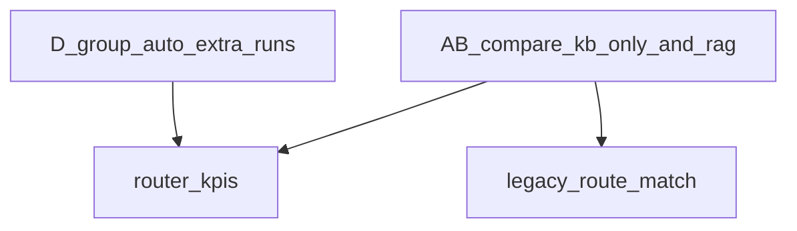

# RAG削減のための KB/Rule 強化 → 残すRAG定義 → ABテスト再設計

**目的**: RAG を減らすのではなく、「RAG に行く前の層を厚くする」。Fast Path・Rule・Clarification・Escalation を前提に、AB 評価と実装の指針を一気通貫で揃える。

**データセット（実行用）**: `eval/datasets/line_rag_eval_router_abcd_v1.csv`  
**レガシー比較用**: `eval/datasets/line_rag_eval_v1.csv`

---

## ① KB/Rule に追加すべき項目（最重要）

**結論**: B 群の多くは、条文全文検索ではなく **明示ルール化**で安く・一貫して答えられる。

### 優先追加ルール一覧（実装推奨）

| rule_id | 質問タイプ | 回答の要旨 | 実装意図 |
|--------|------------|------------|----------|
| `rule_water_flat_plus_overage` | 水道定額＋超過 | 水道料は月額 3,300 円の定額だが、使用量が多い場合は超過分が追加請求される | 「定額？」系の誤解防止 |
| `rule_deposit_settlement_order` | 敷金精算 | 敷金は未払い賃料や原状回復費に充当された後、残額が返金される | 順序の固定化 |
| `rule_smoking_restoration` | 喫煙×原状回復 | 喫煙によるヤニや臭いは通常損耗ではなく原状回復費用の対象になりうる | 法的誤解の抑制 |
| `rule_internet_no_guarantee` | ネット無料だが保証なし | インターネットは無料で利用できるが、通信品質や接続の保証はない | 減額要求の抑制 |
| `rule_no_rent_reduction` | 設備不具合×減額 | 無料設備の不具合を理由とした家賃減額は原則認められない | 紛争の芽を潰す |
| `rule_unauthorized_occupant` | 無断同居 | 契約者以外の入居は認められず、違反時は契約解除の対象となりうる | 重大違反の明示 |
| `rule_key_loss_exception` | 鍵紛失例外 | 鍵交換費用は初期費用では発生しないが、紛失時は入居者負担となりうる | 条件分岐の固定 |
| `rule_early_termination_fee` | 短期解約 | 契約期間内の解約には期間に応じた違約金が発生しうる | 定型化 |
| `rule_cleaning_fee_fixed` | 清掃費 | 退去時の清掃費は理由にかかわらず入居者負担となりうる | 例外の封じ |
| `rule_lifeline_contract` | ライフライン契約 | 電気・ガス・水道は入居者自身で契約手続きが必要 | FAQ 集約 |

### 最重要方針

```text
「例外・条件・誤解が起きやすい領域」はできるだけ Rule（＋KB）に寄せる
```

- RAG よりコストが低い  
- 回答の一貫性が上がる  
- 法的リスクを下げやすい  

---

## ② RAG として残すケース（最終定義）

Rule / Fast Path で削ったあとに **RAG を発動してよい条件**は次の 4 類型に限定する。

### ① 条文・根拠要求

- 例: 契約書のどこに書いてありますか？／根拠を教えてください  
- **理由**: 答えそのものより **検索・引用**が主目的  

### ② 物件固有情報

- 例: ハザードマップ、抵当権、建物仕様  
- **理由**: 汎用 KB 化しにくい  

### ③ 条項横断（複合質問）

- 例: キャンセル＋返金＋契約成立／敷金＋相殺＋未払い賃料  
- **理由**: 単一ルールでは分岐が爆発する  

### ④ Rule 未対応領域

- 例: 新しい特約、未整理の PDF 情報  
- **理由**: ルール追加前のフォールバック  

### RAG に寄せない（禁止に近い）領域

```text
・単純 FAQ
・金額の定型回答
・禁止事項の yes/no
・水道・ネット・喫煙など定型トラブル（上表 rule で吸収）
```

---

## ③ 再設計した AB テスト（A/B/C/D）

評価用 CSV では `ab_group`（A/B/C/D）と `expected_route`（意図した経路）を付与する。`scripts/run_eval.py` の JSONL にそのまま載る。

### A 群（Fast Path + Rule）

**目標**: RAG に行かない（または最小検索で完結）

| ID | 質問 | 期待ルート |
|----|------|------------|
| A1 | 水道代はいくら？ | fast_path |
| A2 | 水道は定額？ | rule |
| A3 | タバコ吸える？ | fast_path |
| A4 | 喫煙したら請求される？ | rule |
| A5 | 敷金ってどう返ってくる？ | rule |
| A6 | ネット使えないけど減額できる？ | rule |
| A7 | 無断同居したら？ | rule |
| A8 | 鍵なくしたら？ | fast_path |
| A9 | 解約違約金ある？ | rule |
| A10 | 清掃費って払うの？ | rule |

### B 群（RAG 必要）

**目標**: 意図どおり RAG（条文検索・横断・固有情報）に乗せる

| ID | 質問 | 期待ルート |
|----|------|------------|
| B1 | 契約書のどこに書いてありますか？ | rag |
| B2 | 抵当権実行されたらどうなる？ | rag |
| B3 | この物件は浸水リスクある？ | rag |
| B4 | キャンセル時の返金条件を全部教えて | rag |
| B5 | 敷金と未払い家賃はどう相殺される？ | rag |
| B6 | 例外的に違約金が免除されるケースは？ | rag |

### C 群（Clarification）

**目標**: 曖昧入力で確認質問に落とす

| ID | 質問 | 期待ルート |
|----|------|------------|
| C1 | ガス | clarification |
| C2 | 証明書 | clarification |
| C3 | 電気 | clarification |

### D 群（Escalation）

**目標**: 法的・訴訟的な助言を止め、エスカレーションへ

| ID | 質問 | 期待ルート |
|----|------|------------|
| D1 | 家賃減額を請求できますか？ | escalation |
| D2 | 訴えたら勝てますか？ | escalation |
| D3 | 法的に違反ですか？ | escalation |

---

## ④ 目標アーキテクチャ（完成形のイメージ）

```text
ユーザー質問
  ↓
Fast Path（目安 ~40%）
  ↓
Rule Engine（目安 ~40%）
  ↓
Clarification（目安 ~10%）
  ↓
RAG（目安 ~5〜10%）
  ↓
Escalation（数%）
```

※ 割合は運用後のログで校正する。**設計の優先順位**が重要。

---

## ⑤ 結論（最大の学び）

- **RAG を薄くする**より **RAG の手前を厚くする**方が、コスト・品質・リスクのバランスが良い。  
- **Rule を強くする**／**Clarification を賢くする**／**Escalation で無理な断定を止める**の三本柱で RAG 依存を下げる。  
- AB 評価は **kb_only vs rag** に加え、将来的には `expected_route` と実ログの一致率を追うと改善ループが回しやすい。

---

## 関連コマンド

```bash
# 新データセットで A/B（セマンティックキャッシュ無効推奨）
python3 scripts/run_eval.py --ab-compare --disable-semantic-cache \
  --dataset eval/datasets/line_rag_eval_router_abcd_v1.csv

cat data/eval/ab_summary.json
cat data/eval/route_mismatch_report.jsonl
```

`route_mismatch_report.jsonl` の絞り込み例:

```bash
grep '"ab_group": "A"' data/eval/route_mismatch_report.jsonl
grep '"mode": "kb_only"' data/eval/route_mismatch_report.jsonl
```

集計ファイル: `data/eval/ab_summary.json`, `data/eval/ab_scored_summary.json`, `data/eval/ab_diff_report.jsonl`, **`data/eval/route_mismatch_report.jsonl`**（厳密 `route_match` 不一致の全件）

---

## ⑥ `route_metrics`（schema_version 2）

**要点**: **A/B 比較ログの集計値 ≠ 本番ルーター性能**。主指標は `router_kpis`、旧来の全体 `route_match` は `legacy_route_match` に閉じ込める。



### JSONL レコード（行ごと）

| フィールド | 意味 |
|------------|------|
| `actual_route` | 推定ルート（`fast_path` / `rule` / `rag` / `escalation` / `unknown`） |
| `route_match` | 厳密一致 `expected_route == actual_route` |
| `route_match_relaxed` | `fast_path` と `rule` を非 RAG 層として等価 |

### `ab_summary.json` の `route_metrics`

| キー | 内容 |
|------|------|
| `schema_version` | **2** |
| **`router_kpis`** | **主指標**（下表） |
| `legacy_route_match` | 補助: 全体 strict/relaxed、`by_ab_group`、`by_mode`、`route_mismatch_examples` |
| `route_mismatch_report` / `route_mismatch_report_rows` | 不一致 JSONL のパスと行数（`route_metrics` 直下） |

#### `router_kpis` 定義

| KPI | 対象 | 意味 |
|-----|------|------|
| `A_non_rag_rate` | A 群 × `kb_only` | `actual_route` が `fast_path` または `rule`（低コスト経路のプロキシ） |
| `B_rag_rate` | B 群 × `rag` レッグ | `actual_route == rag`（RAG 残存候補が強制 RAG で処理されているか） |
| `C_clarification_rate` | — | **`rate` は常に `null`**。`source: line_e2e_required`。0 にしない（誤解防止）。 |
| `D_escalation_rate` | D 群 × **`auto` 追加実行** | `--ab-compare` 完了後、D 行のみ `forced_system=auto`、`cache_namespace=eval:auto_router`、`allow_semantic_cache=false` で再実行し `actual_route==escalation` を数える。`extra_run_count` を併記。 |

### 解釈上の注意

- `actual_route` は **本番トレースではなくオフライン推定**。
- **`rag` レッグ**は強制 RAG のため B 群以外では厳密 `route_match` が崩れやすい → **B_rag_rate** だけを見る。
- **`kb_only` の fast_path/rule** は質問長プロキシ。将来は `kb_fast_path_hit` 等と突合したい。
- **C 群**は LINE state / prior / numeric reply が必要。**オフラインでは測らない**（`null` が正しい）。

### 実行後に見る順（推奨）

1. `route_metrics.router_kpis.A_non_rag_rate`
2. `route_metrics.router_kpis.B_rag_rate`
3. `route_metrics.router_kpis.D_escalation_rate`
4. `route_mismatch_report.jsonl` または `legacy_route_match.route_mismatch_examples`

### 結果を見たあとの判断例

- A: `A_non_rag_rate` と KB 回答品質（不要な RAG 化がないか）
- B: `B_rag_rate` と B 群の `kb_only` が誤って深く答えていないか（Rule 化の再分類）
- C: LINE E2E に切り出す
- D: `D_escalation_rate` と `escalation_data` 強化の要否
